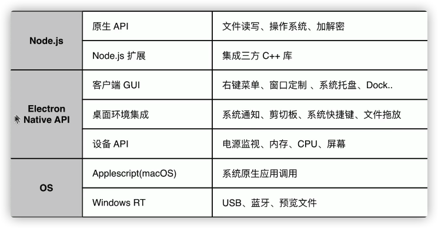

使用ELectron API创建原生GUI

- BrowserWindow 应用窗口
- Tray托盘
- App设置dock.badge
- Menu菜单
- dialog原声弹窗
- TouchBar苹果触控栏

获取系统底层的能力

- clipboard剪切板
- globalShortcut 全局快捷键
- desktopCapture 捕获桌面
- shell打开文件、URL

使用Node.js获取底层能力

- fs文件读写
- crypto加密解密
- npm安装node库

