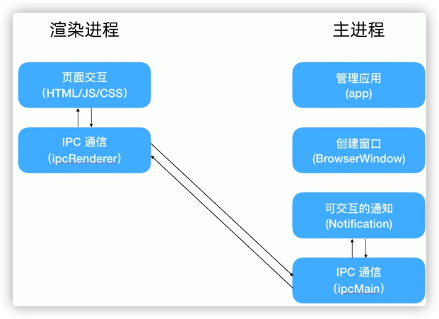

# Electron进程

渲染进程

- 引入模块，各进程直接在electron模块中引入即可

  `const {app,BrowserWindow} = require('election') //主进程引入app`

  `const {ipcRender} = require('electron') // 渲染进程引入ipcRender`

  `ipcRender.invoke(channel,...args).then(res=>{handleResult}) // 渲染进程跟主进程发送请求`

主进程模块

- app，用于控制应用生命周期 `app.on('ready',callback);`

- BrowserWindow，用于创建和控制窗口

  `let win = new BrowserWindow({width, height,....}); // 创建窗口并设置宽高`

  `win.loadURL/loadFile( source ) // 加载页面`

- Notification，创建Notification

  `let notification = new Notification({title,body,actions:[{text,type}]})`

  `notification.show()`

- ipcMain.handle(channel,hander)，处理渲染进程的channel请求，在handler中return返回结果

# ERROR
1. 安装

2. 在render.js中,如果直接使用require会报错，需要在main.js中引入
    webPreferences: {
      nodeIntegration: true,
      contextIsolation: false,
    }

